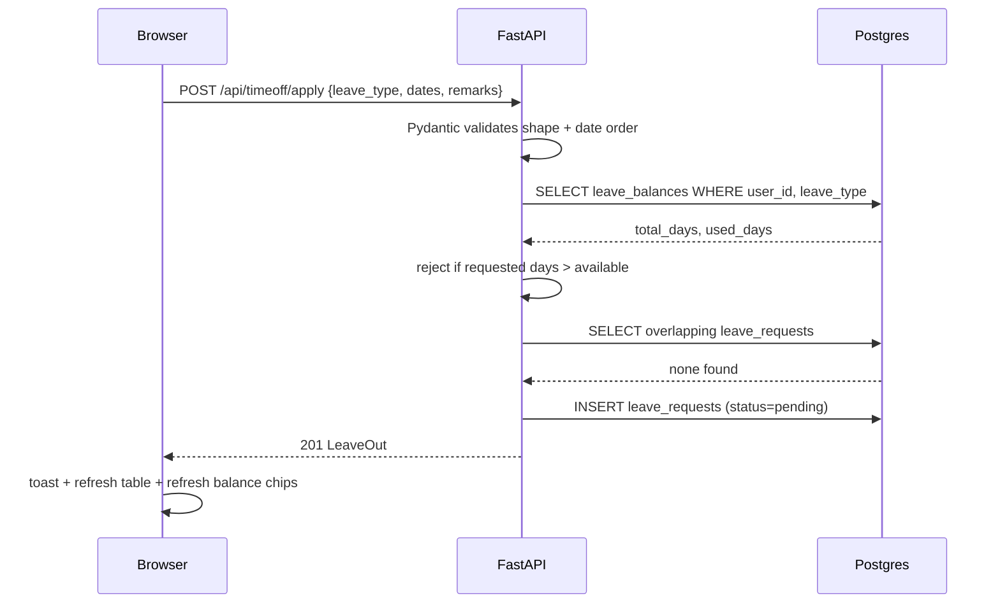

# Architecture & Database Design

## Why this shape

The schema is split so that each wireframe screen maps to roughly one table:

- **Sign in / Sign up** → `companies`, `users`
- **Profile → Private Info** → `employee_profiles`
- **Profile → Resume (skills/certs)** → `employee_skills`, `employee_certifications`
- **Profile → Salary Info** → `salary_structures` (rules only — amounts are
  always *derived*, never stored, so they can never drift out of sync with
  the wage)
- **Attendance** → `attendance` (one row per employee per day, unique constraint
  on `(user_id, work_date)` so check-in/out can't be duplicated)
- **Time Off** → `leave_balances` (running totals) + `leave_requests` (the
  audit trail of what was asked for and decided)

`users` and `employee_profiles` are split 1-to-1 rather than one wide table,
because `users` is what auth/security cares about (password, role, login ID)
while `employee_profiles` is what HR data entry cares about — different
access patterns, different churn rate, cleaner to reason about separately.

## Entity-relationship overview

```mermaid
erDiagram
    COMPANIES ||--o{ USERS : employs
    USERS ||--|| EMPLOYEE_PROFILES : has
    USERS ||--|| SALARY_STRUCTURES : has
    USERS ||--o{ EMPLOYEE_SKILLS : lists
    USERS ||--o{ EMPLOYEE_CERTIFICATIONS : lists
    USERS ||--o{ ATTENDANCE : logs
    USERS ||--o{ LEAVE_BALANCES : has
    USERS ||--o{ LEAVE_REQUESTS : submits
    USERS ||--o{ LEAVE_REQUESTS : decides

    COMPANIES {
        int id PK
        string name
        string code "2-letter code used in login IDs"
    }
    USERS {
        int id PK
        string login_id UK "e.g. OIJODO20260001"
        int company_id FK
        string email UK
        string password_hash
        enum role "admin | employee"
        bool must_change_password
    }
    EMPLOYEE_PROFILES {
        int user_id PK_FK
        string job_position
        string department
        int manager_id FK
        string bank_name
        string pan_no
    }
    SALARY_STRUCTURES {
        int user_id PK_FK
        numeric monthly_wage
        numeric basic_pct
        numeric hra_pct_of_basic
        numeric pf_employee_pct
    }
    ATTENDANCE {
        int id PK
        int user_id FK
        date work_date
        timestamp check_in
        timestamp check_out
        enum status
    }
    LEAVE_BALANCES {
        int id PK
        int user_id FK
        enum leave_type
        numeric total_days
        numeric used_days
    }
    LEAVE_REQUESTS {
        int id PK
        int user_id FK
        enum leave_type
        date start_date
        date end_date
        enum status
        int decided_by FK
    }
```

## API reference (all routes prefixed `/api`)

| Method | Path | Access | Purpose |
|---|---|---|---|
| POST | `/auth/signup` | Public | Create company + first Admin |
| POST | `/auth/login` | Public | Get JWT |
| POST | `/auth/change-password` | Any authenticated user | Set new password |
| GET | `/employees` | Any authenticated user | Directory cards |
| GET | `/employees/me` | Self | Own profile |
| GET | `/employees/{id}` | Self or Admin | View a profile |
| PUT | `/employees/me` | Self | Edit limited fields |
| PUT | `/employees/{id}` | Admin | Edit any field |
| POST | `/employees` | Admin | Create employee (auto login ID + temp password) |
| POST | `/employees/me/skills` | Self | Add a skill |
| POST | `/employees/me/certifications` | Self | Add a certification |
| POST | `/attendance/check-in` | Self | Check in for today |
| POST | `/attendance/check-out` | Self | Check out, computes work/extra hours |
| GET | `/attendance/me` | Self | Month view |
| GET | `/attendance/all` | Admin | Everyone, given day |
| GET | `/timeoff/balances` | Self | Remaining leave by type |
| POST | `/timeoff/apply` | Self | Request leave (validates balance + overlap) |
| GET | `/timeoff/me` | Self | Own requests |
| GET | `/timeoff/all` | Admin | All requests, optional status filter |
| POST | `/timeoff/{id}/decide` | Admin | Approve/reject |
| GET | `/payroll/me` | Self | Read-only computed payslip |
| GET | `/payroll/{id}` | Admin | Any employee's computed payslip |
| PUT | `/payroll/{id}` | Admin | Update wage/% rules, recompute |

## Request flow (example: applying for leave)



## Scalability & security notes

- All list/detail queries are scoped by `company_id`, so the schema already
  supports multi-tenant use without any query changes.
- Indexes on `users.company_id`, `attendance.work_date`,
  `leave_requests.user_id`/`status` keep the hot list/filter queries cheap
  as data grows.
- Stateless JWT auth means the API can be horizontally scaled behind a load
  balancer with no session affinity required.
- Every mutating endpoint re-checks role server-side — the frontend hiding a
  button is a UX nicety, never the actual access control.
